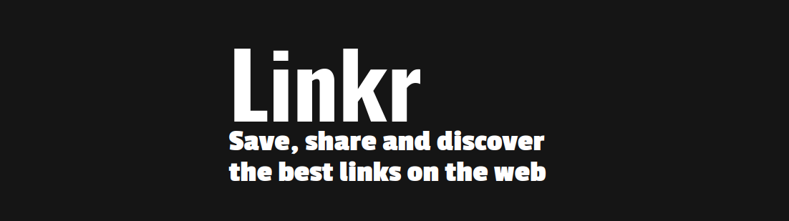
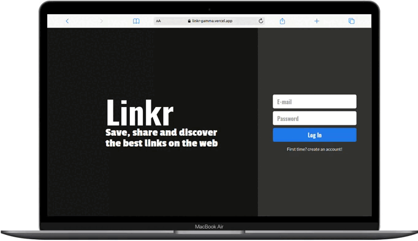

# LINKR

<p align="center">
   
</p>


- No mundo de hoje onde estamos o tempo todo vendo e compartilhando sites, videos e informações com nossos amigos e familiares
- Mas em algum momento já aconteceu com você de ter perdido o link daquele meme, receita ou vídeo, e nunca mais o viu pela intener
- Agora você pode compartilhar os seus links preferidos na nossa rede social de links com o LINKR
- O LINKR é uma rede social completa onde você pode interagir de muitas formas com seus amigos
- [Veja nosso deploy na Vercel aqui](https://linkr-gamma.vercel.app/)
- [Veja nosso repositório back end aqui](https://github.com/frreiro/Linkr-API)

***

# Demonstração

<p align="center">
   
</p>

## Como usar

Instale meu projeto e suas dependências

```bash
  git clone git@github.com:frreiro/Linkr-API.git
  
  npm i
  
  npm start
```

***

## Tecnologias e Conceitos

- HTML
- React
- Styled components
- Persistência de login com local storage
- Context API
- react-tooltip
- react-loader-spinner

***

## Colaboradores
- [Jackie Morais](https://www.linkedin.com/in/moraesjackie)
- [Matheus Mazetti](https://www.linkedin.com/in/matheusmazetti)
- [Lucas Viana](https://www.linkedin.com/in/frreiro)
- [Marco Júnior](https://www.linkedin.com/in/marcojr73)
- [Lucca Rauédys](https://www.linkedin.com/in/luccarauedys)


    
